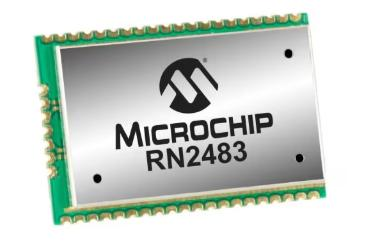

# RN2483_P2P Arduino library

It is a Arduino helper library for implementing peer 2 peer type communication with RN2483 Microchip LoRa modules.

How to install:
1. Download the zip form of this library with this link: https://github.com/Nirison261/RN2483_P2P/archive/refs/tags/v1.0.1.zip
2. Open the arduino IDE
3. Go to Sketch > Include Library > Add .zip Library
4. Select the downloaded ZIP file
5. Wait for the "Library Added" message
6. Check that a category named RN2483_P2P appeared on File > Examples

Tested with arduino UNO R3 board

Datasheet and user's guide for the RN2483 module are provided on the doc/ directory. You can also find them on the Microchip  official website.

Issue tracking: https://github.com/nirison261/rn2483_p2p/issues
